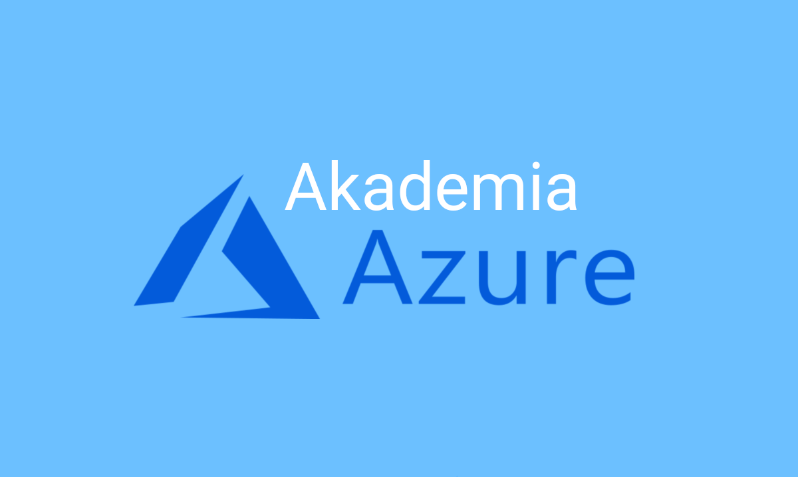

# Akademia Azure

### Witamy Cię w Akademi Azure!

Akademia Azure to cykl otwartych warsztatów z podstaw Microsoft Azure. Warsztaty będą składały się z cotygodniowych spotkań, gdzie na każdym z nich będziemy omawiać kolejne usługi Microsoft Azure.

W tym miejscu będziemy gromadzić wszystkie materiały, prace domowe oraz przykłady ze spotkań. Zadania domowe nie są obowiązkowe, lecz robienie zadań w domu jest najlepszą metodą na poznanie omawianej usługi i utrwalenie zdobytej wiedzy.

Warsztaty będą prowadzone w Białymstoku na [Politechnice Białostockiej ](https://goo.gl/maps/m9qxBiuKB21nSDhC8)w sali WA-130 \(1 piętro\) - czwartki o 18:30. Szczegółowe informacje o datach będą się pojawiać w planie warsztatów oraz w wydarzeniach na [Facebooku](https://www.facebook.com/Grupa.NETBialystok/).

Nie jesteś z Białegostoku lub nie możesz dotrzeć? - nic straconego! Materiały będą tworzone w taki sposób, aby osoby nieobecne lub te spoza Białegostoku mogły również uczestniczyć w naszej Akademii.

### Wymagania:

* Własny laptop
* Zainstalowane Visual Studio 2017+ lub Visual Studio Code \(z zainstalowanymi Azure extensions\)
* Zainstalowane SQL Server Management Studio
* Subskrypcja w Microsoft Azure \(jedna z dostępnych\)
  * Darmowe konto studenckie \(wymagany jest email studenta, np. @student.pb.edu.pl dla Politechniki Białostockiej\) 
  * Darmowe konto próbne na Dev Essentials 
  * Subskrypcja Pay-As-You-Go

### Plan warsztatów:

1. Wprowadzenie do Microsoft Azure.
2. Azure App Service & Azure SQL - wdrożenie pierwszej aplikacji \(**09.05.2019**\)
3. Azure Storage - pliki, kolejki, tabele 
4. Azure Search - zaawansowana wyszukiwarka w kilku krokach
5. Cognitive Services - sztuczna inteligencja w Microsoft Azure
6. Logic Apps - pierwsze kroki w Serverless
7. Azure Functions - 
8. TBA...

