# Blob storage

Będąc na stronie głównej przechodzimy do usługi Blob storage.

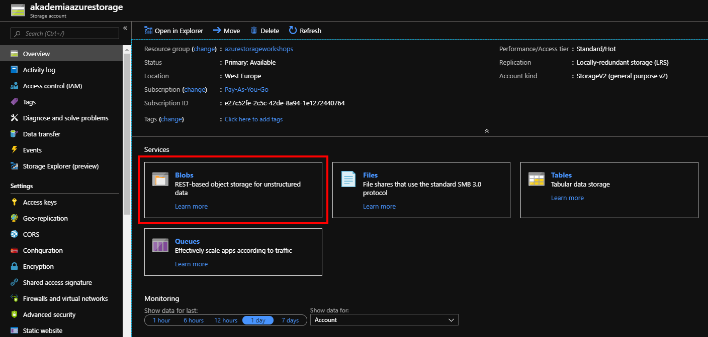

Dodajemy nowy kontener, który będzie pewnego rodzaju pojemnikiem na dane. Dzięki kontenerom możemy w prosty sposób stworzyć przejrzystą strukturę danych.

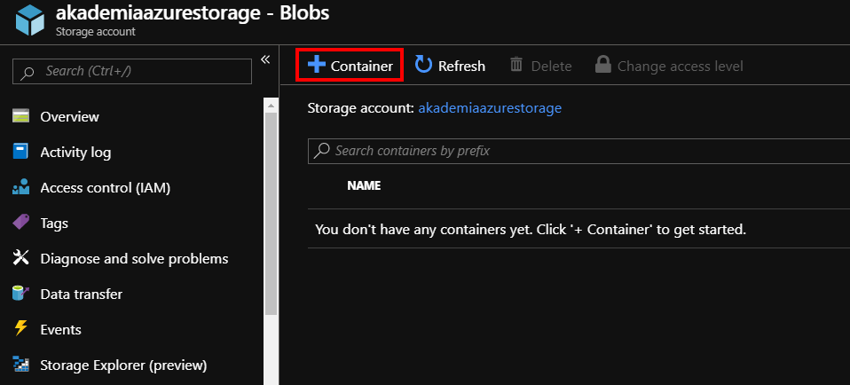

Wpisujemy nazwę kontenera oraz wybieramy jeden z dostępnych poziomów dostępu. W naszym przypadku będzie to Container. Następnie zatwierdzamy OK.

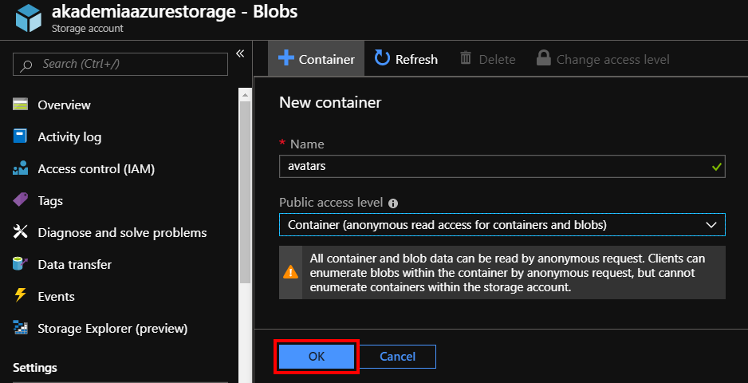

Po przejściu do nowo stworzonego kontenera będziemy mieli dostęp do listy plików znajdujących się w nim oraz możliwość wgrania nowego pliku z dysku.

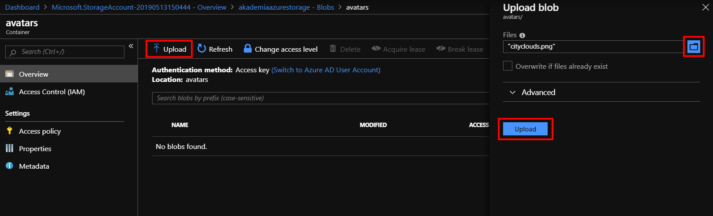

Po dodaniu nowego pliku pojawi się on na liście, gdzie możemy przeglądać szczegóły dotyczące naszych plików oraz pobrać jego bezpośredni adres URL.

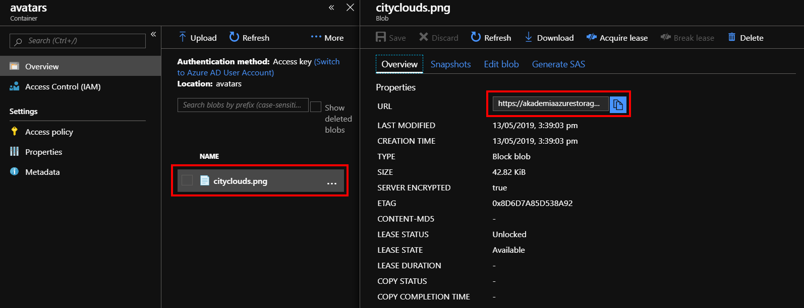

Znacznie wygodniejszą opcją do przeglądania zawartości usług Storage Account jest Storage Explorer.

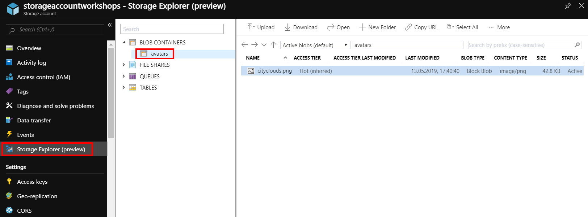

Storage Explorer jest dostępny również do pobrania w wersji desktopowej.

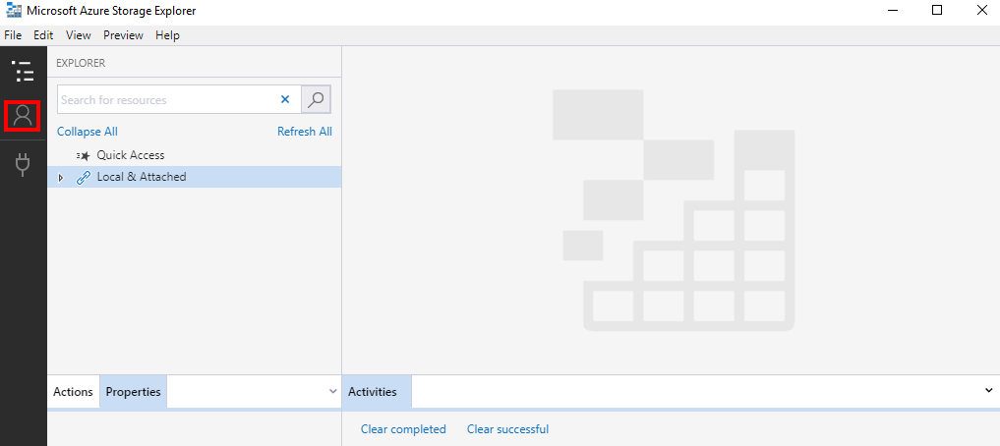

Aby połączyć się z subskrypcją Azure należy przejść do ustawień i dodać konto na którym mamy subskrypcję.

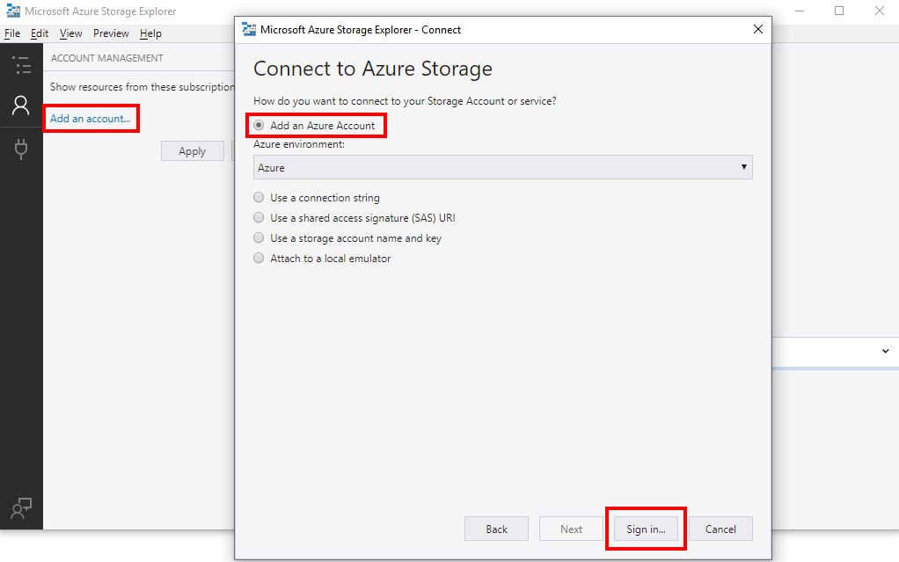

Logujemy się i zatwierdzamy dodanie konta poprzez Apply.

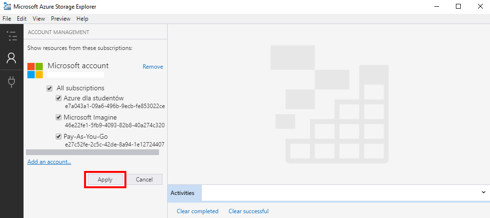

Następnie przechodzimy do strony głównej aplikacji, gdzie możemy przeglądać i zarządzać wszystkimi usługami Storage Account w obrębie subskrypcji dostępnych na danym koncie.

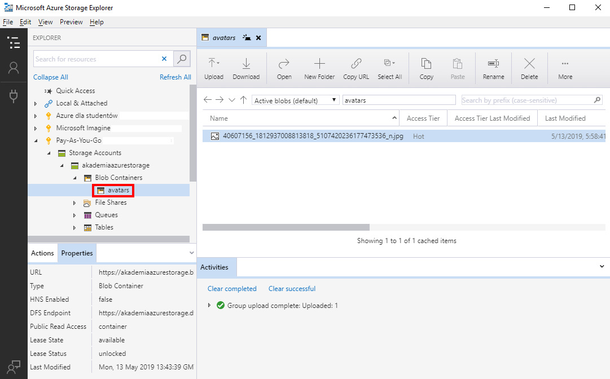

Wracając do portalu – po przejściu do sekcji Access Keys będziemy mieli dostęp do kluczy dostępu, które pozwalają na połączenie się z usługą z aplikacji lub innego serwisu. Klucze są zawsze dwa, na wypadek gdy jeden z kluczy nam wycieknie, możemy przełączyć usługę na drugi i wygenerować nowy – unikając w ten sposób przerwy w działaniu aplikacji.

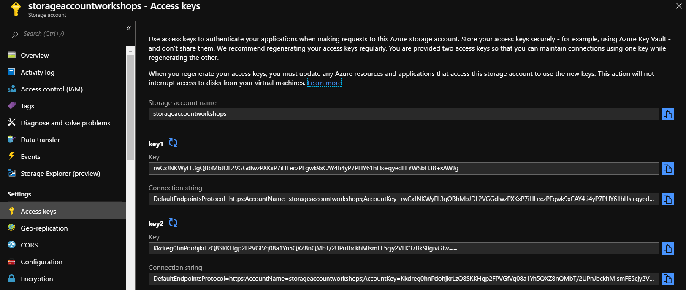

