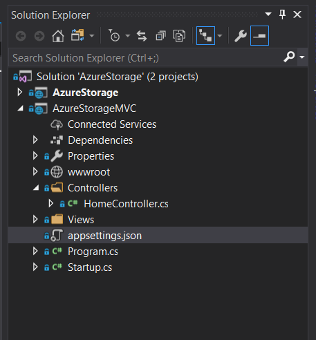
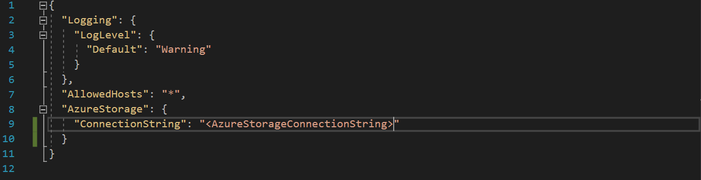
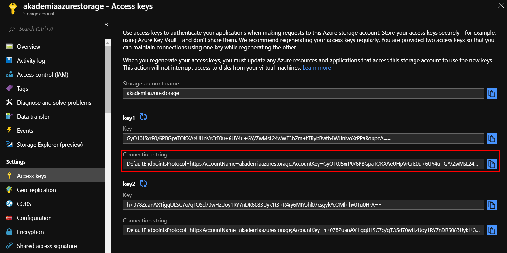
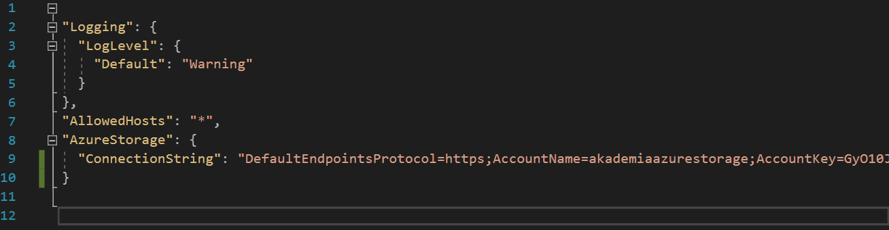
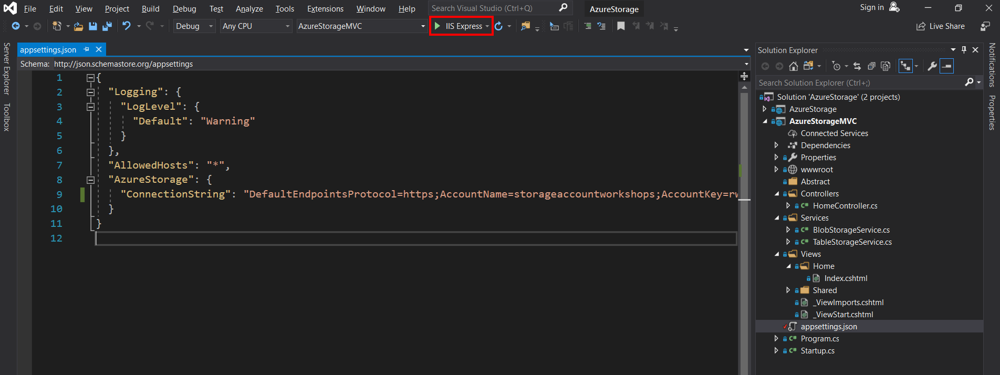
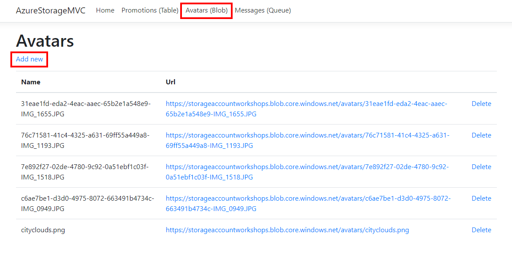
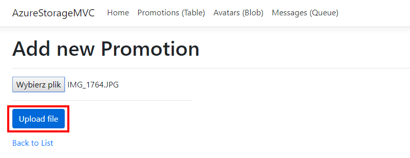

# Połączenie Blob Storage z aplikacją

Przejdziemy teraz do połączenia jednej z omawianych usług z przykładową aplikacją webową. Wybrana usługa to Blob ze względu na jej popularność i częste wykorzystanie w tego typu aplikacjach.

Pobieramy/klonujemy kod aplikacji z GitHuba: [https://github.com/tbr09/AzureStorageWorkshops](https://github.com/tbr09/AzureStorageWorkshops)

Otwieramy solucję \(AzureStorage.sln\) w Visual Studio 2017+ lub Visual Studio Code. Nastepnie w oknie Solution Explorer otwieramy plik appsettings.json.

W pliku mamy dostępne ustawienia niezbędne do połączenia aplikacji z usługą.

Wprowadzamy Connection String do którego mamy dostęp w sekcji Access keys w Portalu Azure.

Następnie uruchamiamy aplikację.

Po uruchomieniu aplikacji zostanie otwarte okno przeglądarki z naszą aplikacją, przechodzimy do zakładki Avatars \(Blob\), następnie do formularza dodawania Add new.

Wybieramy plik z dysku do wgrania i zatwierdzamy Upload file.

Po wgraniu pliku zostaniemy przekierowani do listy, gdzie możemy sprawdzić czy plik wgrał się poprawnie. Inną opcją na sprawdzenie wgrania pliku jest po prostu przejście do programu Azure Storage Explorer.

