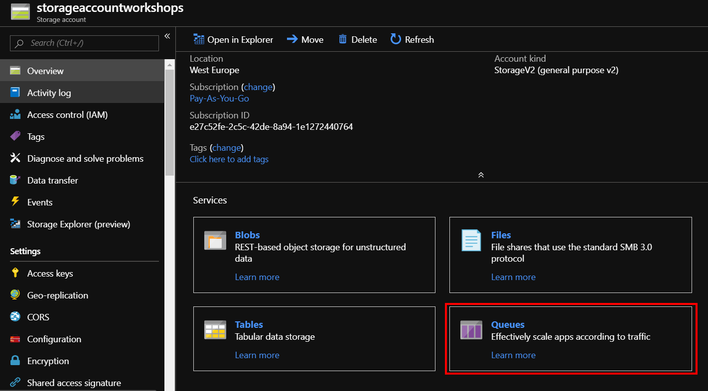
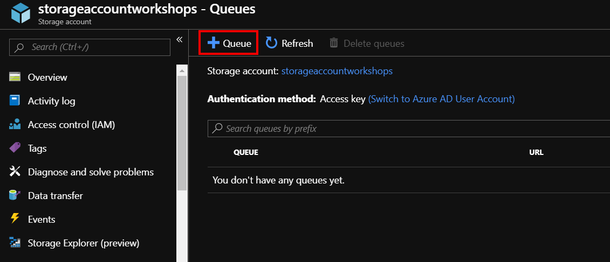
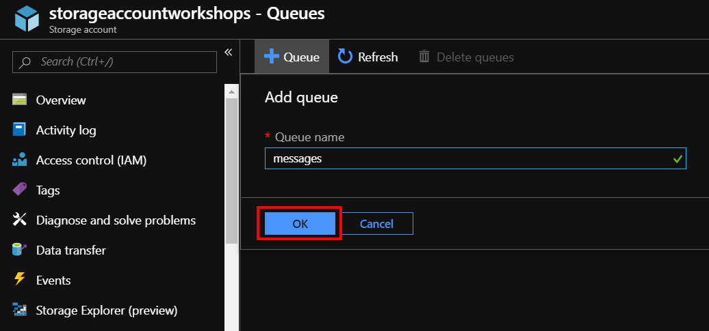
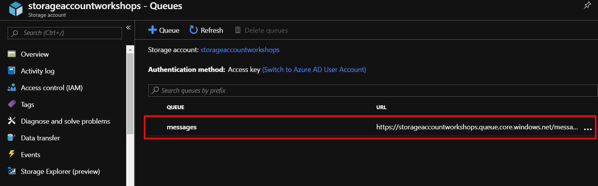
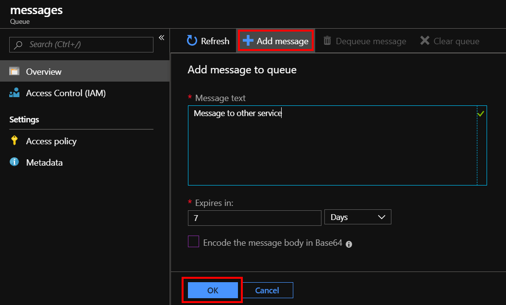
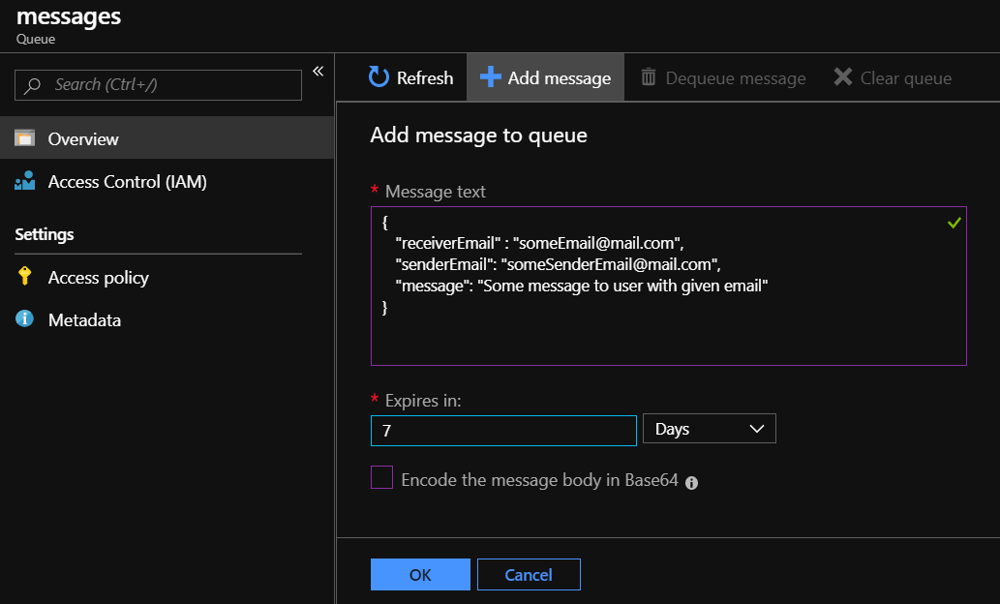

# Queue storage

Kolejną usługą jest Azure Queue Storage, która jest po prostu kolejką FIFO \(First In First Out\). Kolejki są najczęściej używane do przesyłania wiadomości pomiędzy serwisami lub tworzenia kolejek mailingowych.

Tworzenie usługi odbywa się identycznie jak dwie poprzednie. Przechodzimy do panelu głównego Storage Account i wybieramy usługę Queues.

Tworzymy nową kolejkę wybierają Queue.

Następnie nadajemy kolejce nazwę i zatwierdzamy OK.

Przechodzimy do nowo stworzonej kolejki.

Tworzymy nową wiadomość, wpisujemy tekst oraz definiujemy czas wygaśnięcia. Elementy w kolejkach mają swój czas życia, który określa ile czasu wiadomość będzie czekała na odebranie – po minięciu określonego czasu wiadomość zostanie usunięta z kolejki.

W przypadku, gdy chcemy przekazywać bardziej złożone obiekty niż zwykły tekst, możemy wrzucić obiekt w formacie JSON, następnie z poziomu odbierającego serwisu odebrać i przekonwertować dane.

