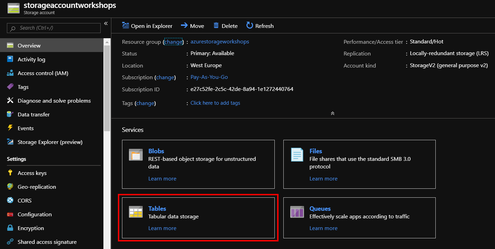
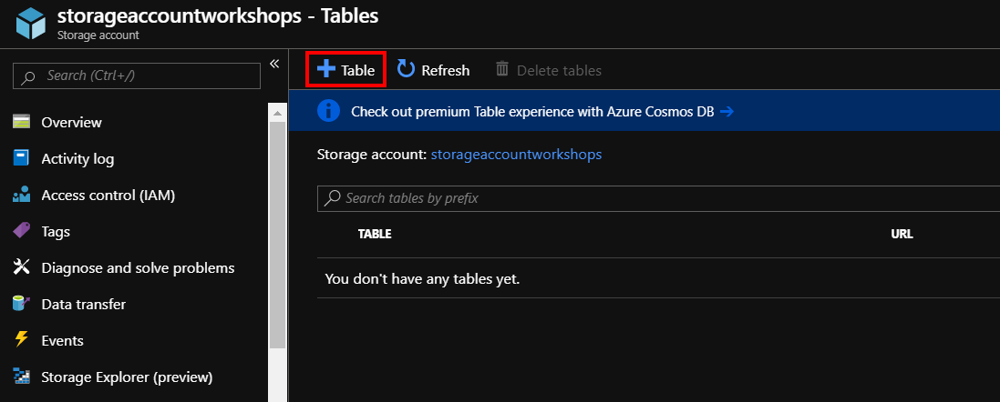
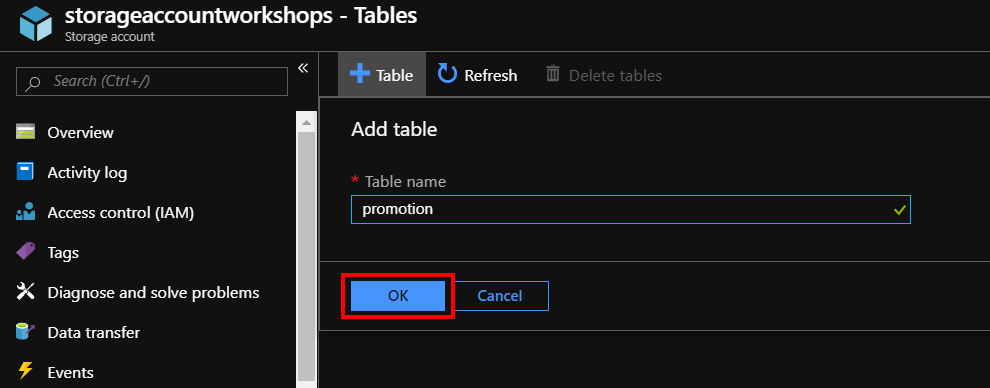
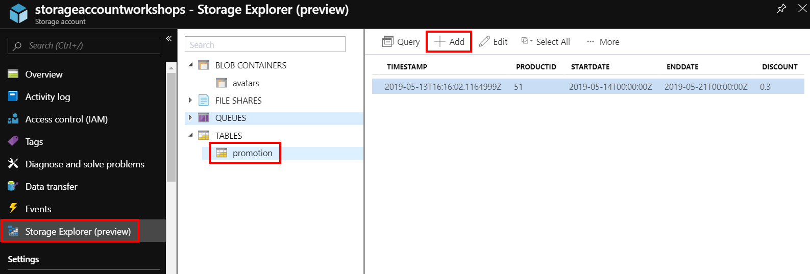
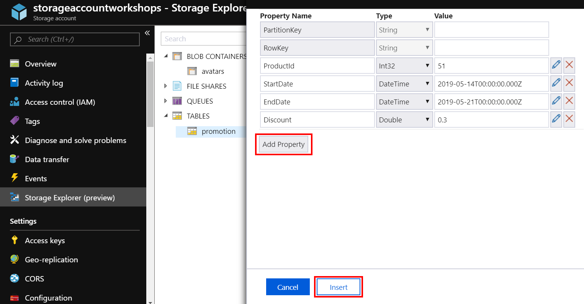
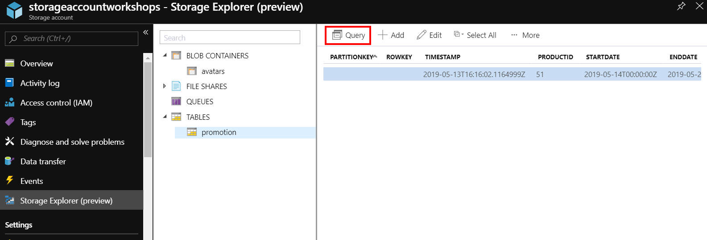
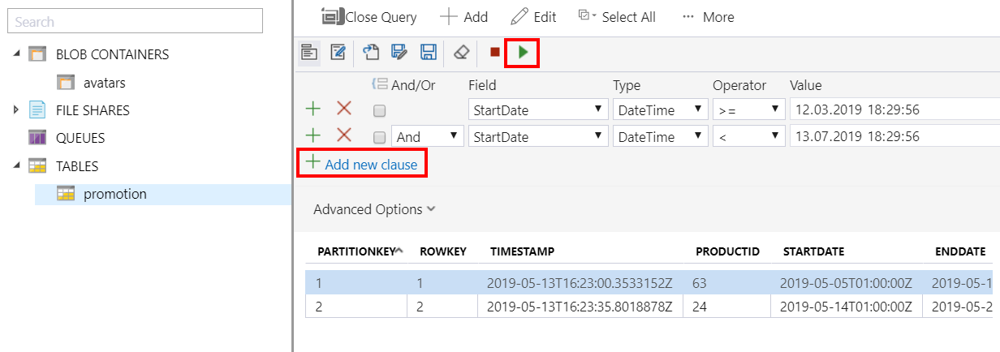

# Table storage

Drugą usługa, którą omówimy jest Azure Table Storage. Aby stworzyć nową tabele należy wybrać Tables na stronie głównej Storage Account.

Po przejściu będziemy mieli listę tabel stworzonych w ramach danej usługi, podobną do listy kontenerów w Blob Storage. Na razie nasza lista tabel jest pusta, tworzymy nową tabelę poprzez Table.

Nadajemy nazwę dla tabeli i zatwierdzamy OK.

Następnie przechodzimy do Storage Explorer gdzie dodamy nowy rekord do tabeli wybierając opcję Add**.**

Dodajemy kolejne kolumny poprzez Add Property, nadajemy nazwy, typy danych oraz wartości. Zatwierdzamy dodanie nowego obiektu klikając na Insert**.**

Zawartość tabel możemy wyszukiwać wykonując zapytania – Query**.**

Zapytania budujemy dodając nowe klauzule, które możemy sumować \(or\) lub wyznaczać części wspólne \(and**\).**

