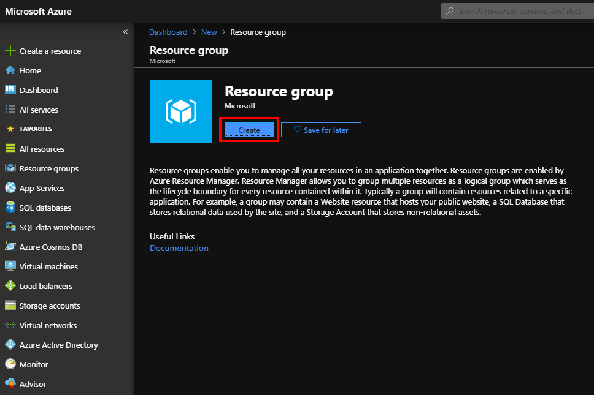
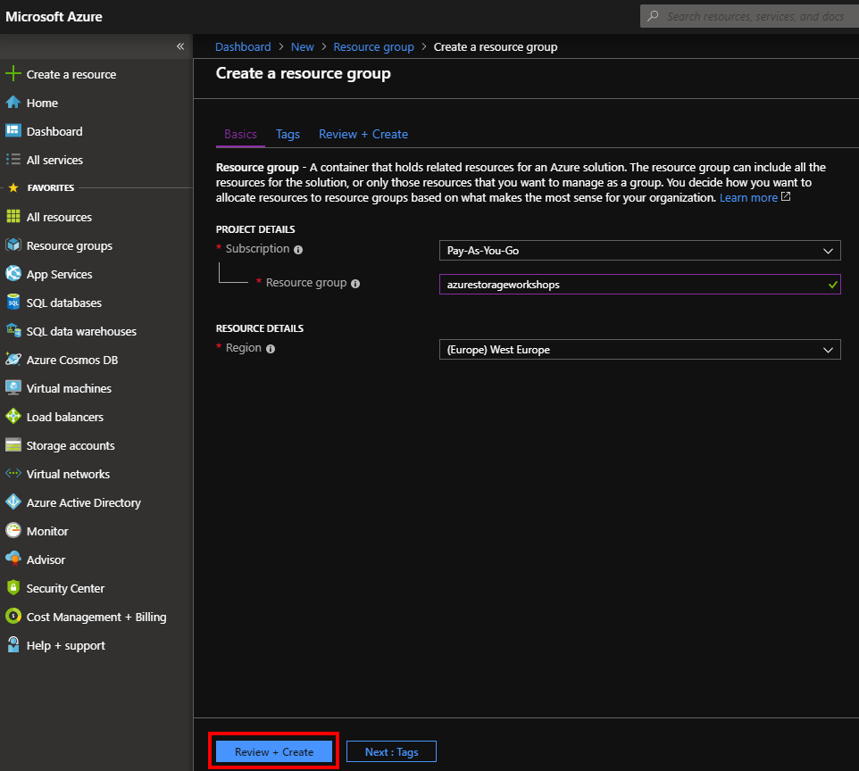
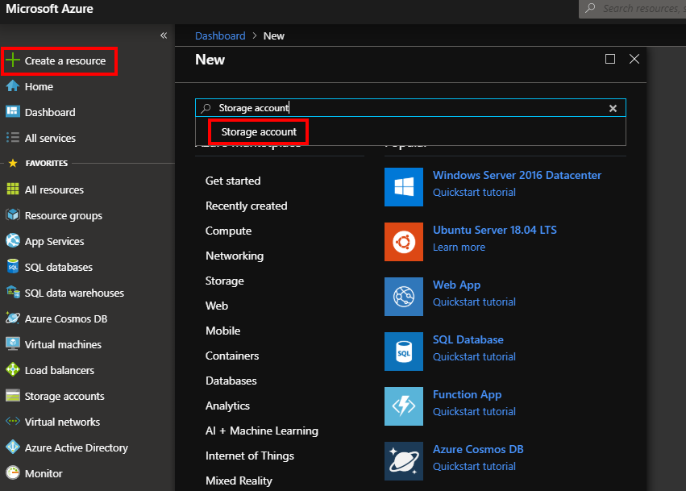
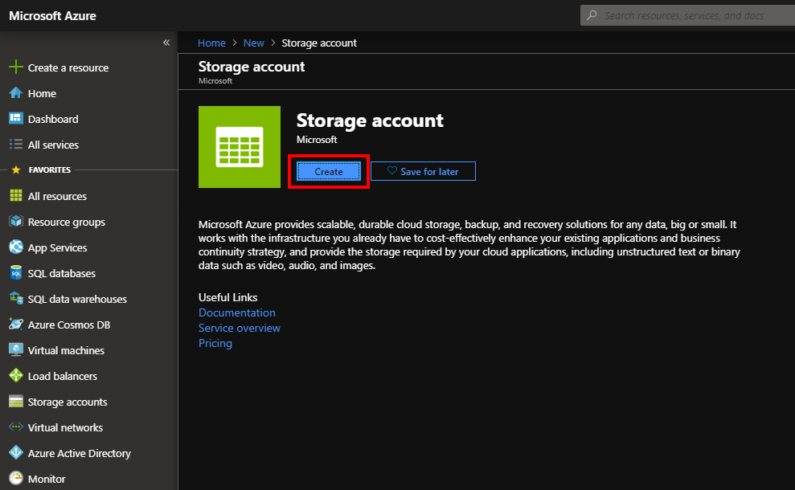
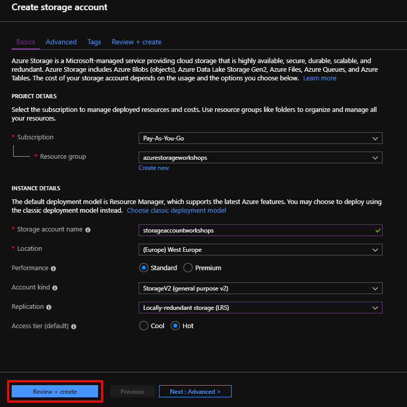
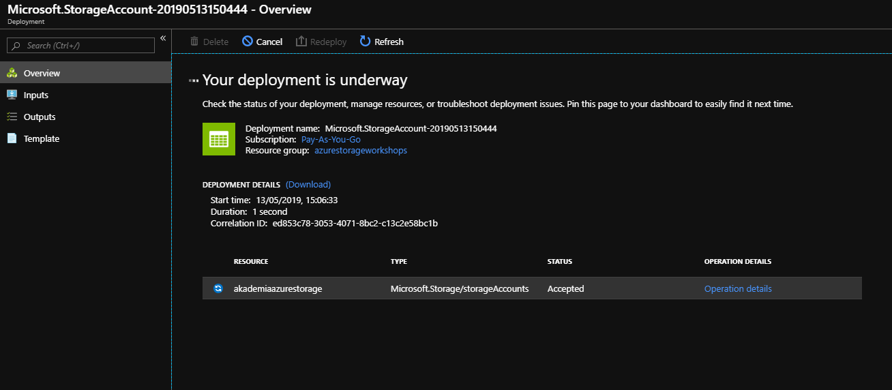
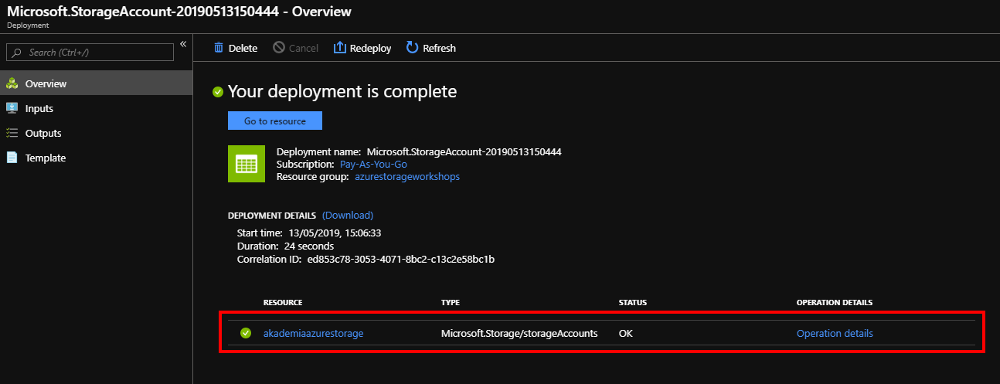
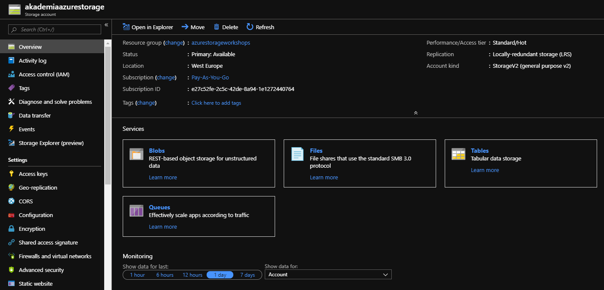

# Tworzenie usługi Storage Account

Po przejściu do portalu Azure tworzymy nowy zasób - wybieramy Create a resource, następnie szukamy zasobu o nazwie Resource Group, który będzie kontenerem przechowującym usługi na potrzeby tego tutoriala.

Po wybraniu usługi ujrzymy jej opis oraz opcję Create, którą wybieramy.

Po wybraniu opcji Create zostaniemy przeniesieni do widoku tworzenia wybranej przez nas usługi. Wybieramy subskrypcję w ramach której tworzymy usługę, podajemy nazwę oraz region w którym zostanie stworzona i tworzymy poprzez Create.

Gdy mamy już stworzoną grupę zasobów, przechodzimy do zakładania usługi Storage Account.

Po przejściu dalej ujrzymy opis usługi oraz opcję Create, którą wybieramy.

Podczas tworzenia usługi mamy dostępnych kilka opcji i ustawień do wyboru.

Lista opcji:

* Subscription – subskrypcja w ramach której zostanie utworzona usługa
* Resource group – wybieramy grupę zasobów w której ma zostać osadzona nasza usługa, w tym przypadku będzie to grupa, którą stworzyliśmy na potrzeby tego tutoriala
* Storage account name – nazwa naszej usługi
* Location – lokalizacja w której usługa będzie fizycznie się znajdować, zalecaną praktyką jest trzymanie usług w tej samej lokalizacji dla jednej grupy zasobów
* Performance – typ usługi, którego wybór zależy od scenariuszy dostępu do danych, opcja
  * Standard jest przeznaczona dla pamięci masowej, która jest raczej rzadziej odczytywana.
  * Premium – używa się w przypadku aplikacji z dużym obciążeniem, zapewnia wysoką wydajność, oraz szybszy dostęp do danych.
* Account kind – typy kont storage, każdy z typów wspiera innego rodzaju funkcjonalności oraz posiada swój własny model rozliczeń. Na potrzeby tutoriala nie będziemy wgłębiać się w szczegóły dotyczący typów kont. Wybieramy **General-purpose v2** będące nowszą wersją General-purpose v1.
* Replication – strategia replikacji, czyli procesu powielania danych w wielu miejscach jednocześnie w celu zwiększenia szybkości dostępu oraz niezawodności w przypadku awarii.
  * Locally redundant storage \(LRS\) – replikacja w obrębie jednego datacenter
  * Zone-redundant storage  \(ZRS\) – replikacja pomiędzy datacenter w obrębie jednego regionu
  * Geo-redundant storage \(GRS\) – replikacja danych do drugiego, odległego regionu.
  * Read-access geo-redundant storage \(RA-GRS\) – replikacja danych do drugiego regionu, tak jak w przypadku GRS z tą różnicą że dane w replikowanym regionie są dostępne tylko do odczytu
* Access tier – dostępny tylko dla opcji Standard, dobry wybór poziomu dostępu może znacznie zwiększyć wydajność usługi oraz zmniejszyć koszty
  * Cool – rzadki dostęp do danych
  * Hot – dane odczytywane z wysoką częstotliwością

Wybieramy ustawienia tak jak na powyższym zrzucie ekranu i przechodzimy do podsumowania, gdzie mamy dostępne wszystkie informacje o usłudze.

Po zatwierdzeniu przyciskiem Create zostajemy przeniesieni do okna gdzie możemy śledzić proces tworzenia usługi oraz sprawdzać jej aktualny status.

Gdy proces tworzenia zakończy się sukcesem możemy przejść do nowo stworzonego Account Storage.

Po przejściu do strony głównej Storage Account zobaczymy 4 usługi: Blobs, Files, Tables oraz Queues. Podczas warsztatów stworzymy 3 usługi \(pomijając Azure Files\) zaczynając od najpopularniejszej z nich, czyli Blob Storage.

