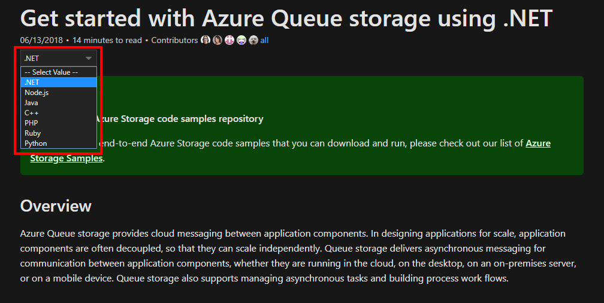

# Praca domowa

Zad 1. Stwórz usługę Azure Blob zawierającą kilka kontenery oraz wewnętrzną strukturę plików dla każdego z kontenerów, np. folder „images/s”, „images/m”, „images/l” – struktura dla różnych rozmiarów obrazów. Kontener powinien być skonfigurowany w taki sposób, aby był dostępny publicznie.

Zad 2. Wygeneruj dostęp do kontenera za pomocą Shared Access Signature, który wygaśnie po określonym czasie.

Zad 3. Stwórz implementację do obsługi dodawania oraz usuwania wiadomości z kolejki Azure Queue Storage. Zadanie może być zrealizowane w jednej ze wspieranych technologii, więcej informacji pod linkiem: [https://docs.microsoft.com/en-us/azure/storage/queues/storage-dotnet-how-to-use-queues](https://docs.microsoft.com/en-us/azure/storage/queues/storage-dotnet-how-to-use-queue)

Zad 4. Zaimplementuj wgrywanie plików na Azure Blob w zależności od rozszerzenia pliku. Pliki graficzne powinny zapisywać się do kontenera „images”, natomiast dokumenty \(txt,docx itd.\) do kontenera „documents”. Zadanie to może być zrealizowane w jednej ze wspieranych technologii przez Storage Accounts - .NET, Java, Python, Javascript.

Rozwiązaniem zadań mogą być zrzuty ekranu z procesu ich wykonywania. 😊

